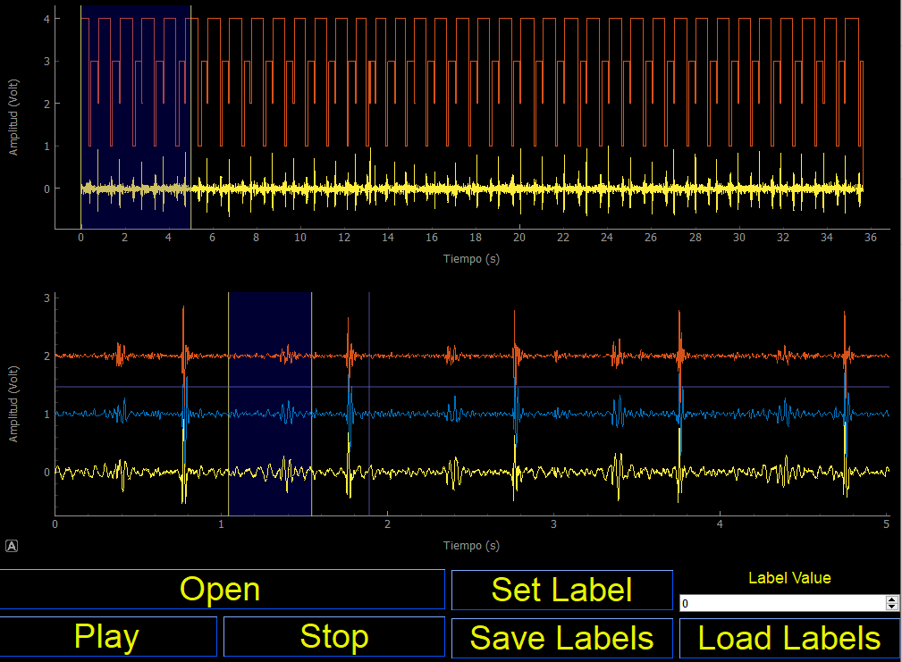

# Introduction
The Open Source AID Labelling Tool is a graphical user interface (GUI) that can be used to create numerical labels in audio signals. When using this tool you would be able to load sound files in .wav, listen to the sound, select region of interest and generate, save and load labels in .csv excel files.

In further versions, we will try a more object oriented programming code structure, by saving the lines of code corresponding to GUI setup in another file. We can definitaly add more features, so please feel free to contribute.

## Software Requirements
The quickest way to have all libraries ready is by installing the last version of Anaconda 4.8.3 (or a higher version) and Qt Designer 5.2.1 (or a higher version) if you would like to modify the GUI.
Secondly, we need to ensure that we have installed the next python libraries:

* Sounddevice
* pyqtgraph
* Pandas
* PyQt5

Please make sure all libraries get install in Python 3

## Files Description
* "PCG_py_2.py" contains the main code of the GUI
* "PCG_ui_2.ui" contains the GUI developed in the software Qt Designer. 
* "aidiagnostics_toolbox.py" contains the some functions used in the main file. 

## GUI preview
Once everything gets installed you will display a GUI, load your sounds and create your labels same as the picture bellow:

## Contact
info@aidiagnostics.co.uk
